# DDoni Design System

여러 React 프로젝트에서 재사용할 수 있는 npm workspaces 기반 디자인 시스템입니다. SCSS Modules로 컴포넌트 스타일을 작성하고, `--dds-*` CSS Custom Properties를 공개 테마 API로 제공합니다.

## 패키지

- `@ddoni-ds/tokens`: light, dark, system 테마를 포함한 CSS 토큰
- `@ddoni-ds/ui`: React 컴포넌트와 컴포넌트 CSS
- `@ddoni-ds/tailwind`: Tailwind CSS v4 선택형 테마 어댑터

Node.js 20.19 이상과 npm을 사용합니다. `@ddoni-ds/ui`는 React 18.2 이상 및 React 19를 지원합니다.

## 컴포넌트 카탈로그

아래 미리보기는 각 컴포넌트의 Storybook 대표 상태를 캡처한 것입니다. 전체 props와 접근성 동작은 로컬 Storybook에서 확인할 수 있습니다.

### Actions

<table>
  <tr>
    <td width="50%" valign="top">
      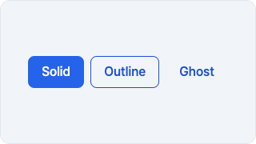<br />
      <strong>Button</strong><br />
      주요 작업을 표현하는 버튼입니다. tone, variant, size와 로딩 상태를 제공합니다.
    </td>
    <td width="50%" valign="top">
      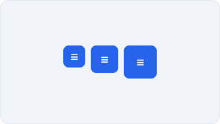<br />
      <strong>IconButton</strong><br />
      툴바나 카드 액션처럼 아이콘만으로 표현하는 컴팩트한 버튼입니다.
    </td>
  </tr>
</table>

### Forms

<table>
  <tr>
    <td width="50%" valign="top">
      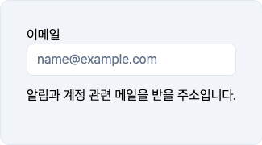<br />
      <strong>Input</strong><br />
      텍스트 입력을 위한 기본 컨트롤로 label, 설명, 오류 상태와 함께 사용할 수 있습니다.
    </td>
    <td width="50%" valign="top">
      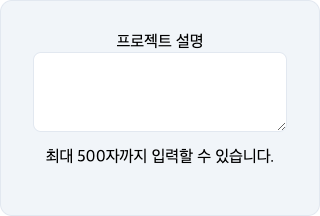<br />
      <strong>Textarea</strong><br />
      여러 줄의 텍스트를 입력받으며 리사이즈와 유효성 상태를 지원합니다.
    </td>
  </tr>
  <tr>
    <td width="50%" valign="top">
      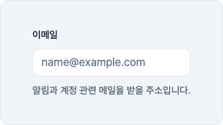<br />
      <strong>Field</strong><br />
      label, 설명, 오류 메시지와 입력 컨트롤을 접근성 있게 묶어 줍니다.
    </td>
    <td width="50%" valign="top">
      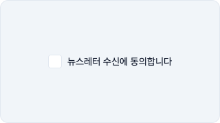<br />
      <strong>Checkbox</strong><br />
      다중 선택과 indeterminate 상태를 지원하는 체크 컨트롤입니다.
    </td>
  </tr>
  <tr>
    <td width="50%" valign="top">
      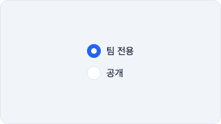<br />
      <strong>RadioGroup</strong><br />
      여러 옵션 중 하나를 선택하는 폼 그룹입니다.
    </td>
    <td width="50%" valign="top">
      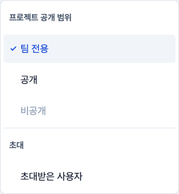<br />
      <strong>Select</strong><br />
      키보드로도 조작 가능한 옵션 선택 컨트롤입니다.
    </td>
  </tr>
  <tr>
    <td width="50%" valign="top">
      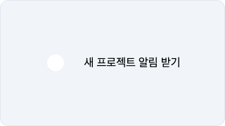<br />
      <strong>Switch</strong><br />
      알림처럼 즉시 적용되는 on/off 환경설정에 사용합니다.
    </td>
    <td width="50%" valign="top">
      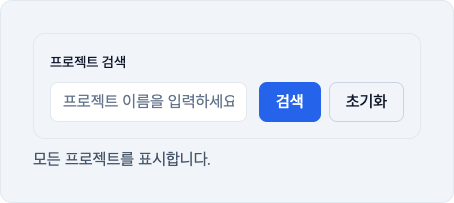<br />
      <strong>FilterBar</strong><br />
      검색·필터·초기화 액션을 한 줄로 구성하는 폼 패턴입니다.
    </td>
  </tr>
</table>

### Layout & Navigation

<table>
  <tr>
    <td width="50%" valign="top">
      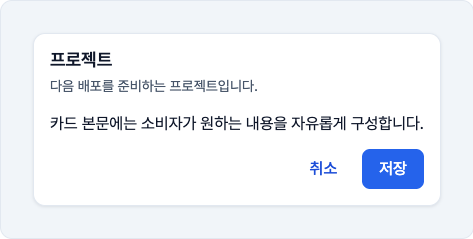<br />
      <strong>Card</strong><br />
      제목, 본문, 푸터로 관련 콘텐츠를 묶는 표면 컨테이너입니다.
    </td>
    <td width="50%" valign="top">
      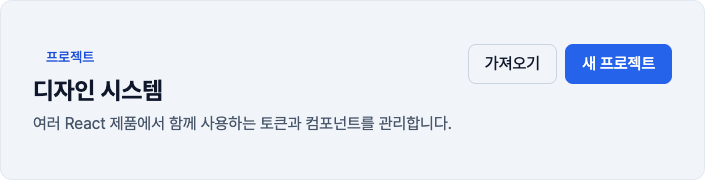<br />
      <strong>PageHeader</strong><br />
      페이지 제목, 설명, 주요 액션을 일관된 구조로 제공합니다.
    </td>
  </tr>
  <tr>
    <td width="50%" valign="top">
      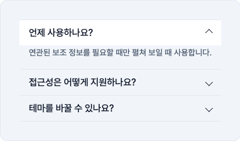<br />
      <strong>Accordion</strong><br />
      콘텐츠를 접고 펼치는 disclosure 패턴으로, 키보드 탐색을 지원합니다.
    </td>
    <td width="50%" valign="top">
      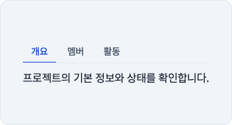<br />
      <strong>Tabs</strong><br />
      관련 패널 사이를 전환하는 접근성 있는 탭 내비게이션입니다.
    </td>
  </tr>
  <tr>
    <td width="50%" valign="top">
      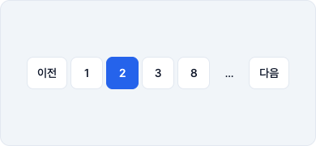<br />
      <strong>Pagination</strong><br />
      목록이나 검색 결과의 페이지 이동을 명확하게 표시합니다.
    </td>
    <td width="50%" valign="top"></td>
  </tr>
</table>

### Data Display & Feedback

<table>
  <tr>
    <td width="50%" valign="top">
      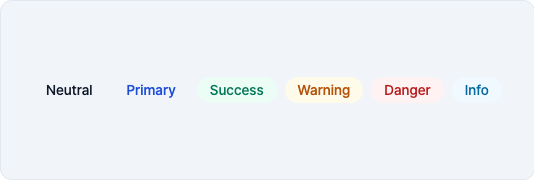<br />
      <strong>Badge</strong><br />
      상태, 분류, 수량처럼 짧은 메타데이터를 톤과 점 표시로 전달합니다.
    </td>
    <td width="50%" valign="top">
      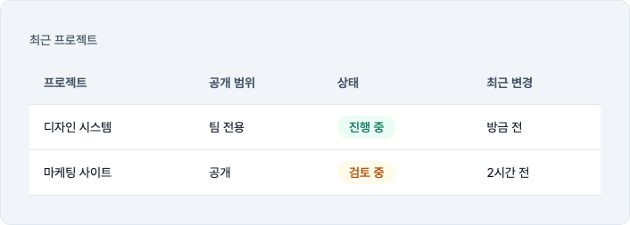<br />
      <strong>Table</strong><br />
      헤더, 본문, 푸터를 갖춘 시맨틱 데이터 테이블입니다.
    </td>
  </tr>
  <tr>
    <td width="50%" valign="top">
      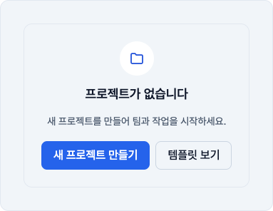<br />
      <strong>EmptyState</strong><br />
      비어 있는 화면의 맥락을 설명하고 다음 행동을 안내합니다.
    </td>
    <td width="50%" valign="top">
      <br />
      <strong>Skeleton</strong><br />
      콘텐츠가 로드되기 전 구조를 보여 주는 로딩 플레이스홀더입니다.
    </td>
  </tr>
  <tr>
    <td width="50%" valign="top">
      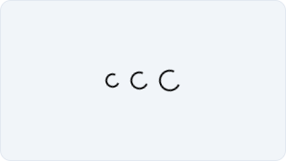<br />
      <strong>Spinner</strong><br />
      짧은 대기 작업의 진행 중 상태를 표시합니다.
    </td>
    <td width="50%" valign="top">
      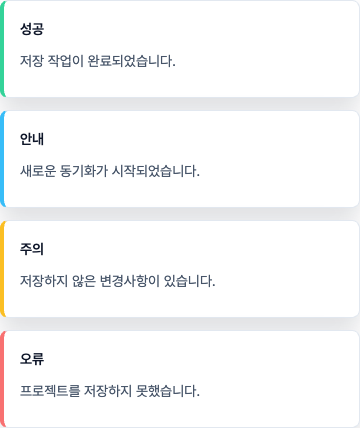<br />
      <strong>Toast</strong><br />
      작업 결과를 방해 없이 알리며 톤, 액션, 닫기 동작을 제공합니다.
    </td>
  </tr>
</table>

### Overlays

<table>
  <tr>
    <td width="50%" valign="top">
      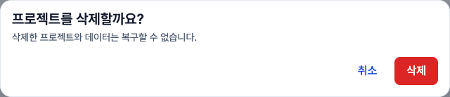<br />
      <strong>Dialog</strong><br />
      확인이나 중요한 입력처럼 사용자의 주의를 요구하는 모달입니다.
    </td>
    <td width="50%" valign="top">
      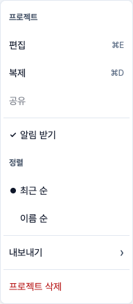<br />
      <strong>DropdownMenu</strong><br />
      액션, 체크, 라디오 옵션을 담는 컨텍스트 메뉴입니다.
    </td>
  </tr>
  <tr>
    <td width="50%" valign="top">
      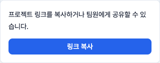<br />
      <strong>Popover</strong><br />
      트리거 근처에 보조 정보나 간단한 작업을 표시합니다.
    </td>
    <td width="50%" valign="top">
      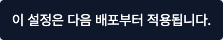<br />
      <strong>Tooltip</strong><br />
      아이콘이나 짧은 UI에 대한 보충 설명을 hover와 focus에서 제공합니다.
    </td>
  </tr>
</table>

## 일반 React에서 사용하기

```bash
npm install @ddoni-ds/ui @ddoni-ds/tokens
```

애플리케이션 엔트리에서 토큰 CSS를 컴포넌트 CSS보다 먼저 불러옵니다.

```tsx
import "@ddoni-ds/tokens/tokens.css";
import "@ddoni-ds/ui/styles.css";
import { Button } from "@ddoni-ds/ui";

export function SaveButton() {
  return <Button>저장</Button>;
}
```

## Tailwind CSS v4에서 사용하기

```bash
npm install @ddoni-ds/ui @ddoni-ds/tokens @ddoni-ds/tailwind
```

```css
@import "tailwindcss";
@import "@ddoni-ds/tokens/tokens.css";
@import "@ddoni-ds/tailwind/theme.css";
@import "@ddoni-ds/ui/styles.css";
```

어댑터는 semantic token을 `bg-dds-canvas`, `text-dds-text`, `p-dds-4` 같은 Tailwind utility로 연결합니다. UI 패키지 자체는 Tailwind에 의존하지 않습니다.

## 테마와 브랜드 재정의

루트나 하위 컨테이너에 `data-dds-theme="light"`, `"dark"`, `"system"`을 설정할 수 있습니다. 속성이 없으면 light 테마가 기본입니다.

```css
[data-dds-brand="teal"] {
  --dds-color-brand-300: #5eead4;
  --dds-color-brand-400: #2dd4bf;
  --dds-color-brand-500: #0d8278;
  --dds-color-brand-600: #0f766e;
  --dds-color-brand-700: #115e59;
  --dds-color-brand-800: #134e4a;
  --dds-control-radius: 12px;
}
```

```tsx
<section data-dds-brand="teal" data-dds-theme="dark">
  <Button>청록색 브랜드 버튼</Button>
</section>
```

## 저장소 개발

```bash
npm ci
npm run check
```

`npm run check`는 format, lint, stylelint, typecheck, component test, package/example build, Storybook build와 package tarball 검사를 실행합니다. 구현 기준은 `docs/DESIGN_SYSTEM_IMPLEMENTATION_SPEC.md`, 진행 상태는 `docs/IMPLEMENTATION_STATUS.md`에서 확인할 수 있습니다.

릴리즈 전 확인과 npm 배포 순서는 [릴리즈 절차](docs/RELEASE.md)를 따릅니다. 현재 준비 버전은 `0.5.0`입니다.

## Storybook 문서 사이트

`develop` 브랜치에 push하면 GitHub Pages 배포 workflow가 Storybook을 정적으로 빌드합니다. 기본 주소는 [DDoni Design System Storybook](https://ddoniddoni.github.io/design/)입니다. Pages 설정과 운영 방법은 [GitHub Pages 배포 안내](docs/GITHUB_PAGES.md)를 따릅니다.
